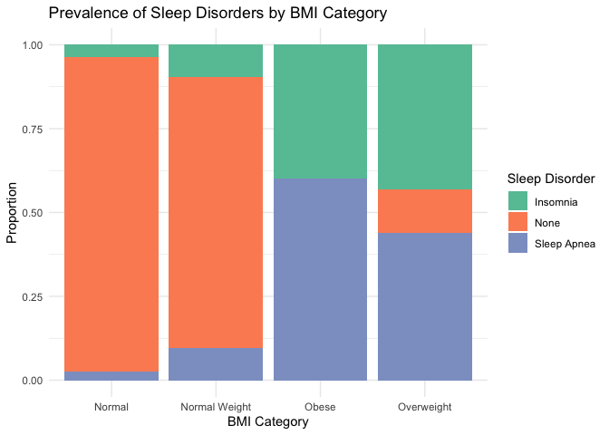
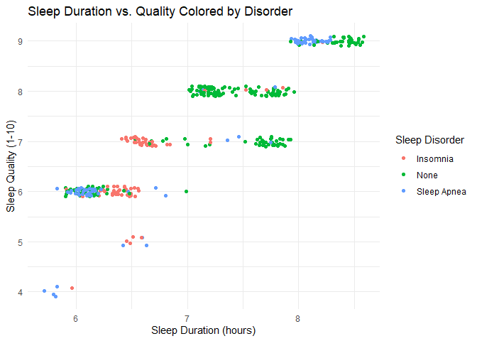

DS 202 Final Project
================

<!-- README.md is generated from README.Rmd. Please edit the README.Rmd file -->

This repository serves as a starter repo for your final project, and
this Rmd is supposed to serve as a starter file for your project report.

## Part I: Repo Structure

The structure sketched out below is an idea of what your repository
might look like. You can use it as a starting base and change according
to your needs. But think about the changes that you make!

    -- code
    |   |   -- any R scripts you need but don't want to include directly in the write-up
    -- data
    |   |   -- csv files (cleaned data)
    -- data-raw
    |   |   -- raw data files 
    |   |   -- data description files, origin
    |   |   -- Codebook
    -- final-project.Rmd
    -- images  # only images that are not created by the Rmd
    -- LICENSE
    -- README.md
    -- README.Rmd
    -- README_files # folder with files created during the knitting process

## Part II: Project report

# Title of your project

Authors: Cole Flickinger, Isaac Irving, Cameron Kraklio

## Abstract (TL;DR)

An abstract is a quick summary of your work. Ideally it should motivate
someone to read the rest of the paper. Include one sentence each on

- what is the project about?
- what is the motivation for doing it?
- what data is your work based on? and where does it come from? = what
  are your main findings? (one sentence each)

# Intro/Background/Motivation

What is the topic of your project, why is it relevant? Our project looks
at a number of health categories and how they relate to sleep and
lifestyle choices. It is relevant since sleep and health statistics are
categories that everyone is going to be concernerd about.

At the end of the Intro, write a sentence describing what each of the
(result) sections is about, e.g. in section [Results 1](#results-1) we
show the relationship between XXX and YYY, section [Results
2](#results-2) also considers the effect of variable ZZZ. … Finally we
conclude with a quick summary of our findings and potential follow-up
work in section [Conclusions](#conclusions).

Somewhere at the beginning of your project, include a code chunk that
includes all of the R packages you are using throughout. In this
document, the setup code chunk is called `setup` (see line 8) Also make
sure to set defaults for the code chunks - like should they be visible?
(probably not: echo=FALSE). Do you want to automatically include
warnings? (probably yes, for creating the Rmd, to make sure that all
warnings are accounted for)

# Quick Data Summary

What are the variables that you will be using in the main part of the
report? What are their ranges? You could include a table with variable
names, a short explanation, and (very broad) summary statistics.

The variables we will be focusing on are: Occupation: what the person
does for work Stress level - ranged from 3 to 8 Sleep duration - ranges
from 5.8 to 8.5 hours Quality of sleep - ranges from 4 to 9 BMI
category - what category the person fits into on the BMI scale

# Results

Each line of exploration is supposed to be featured in one of the
Results sections. Make sure to change to more interesting section
headers!

## Results 1

<small><strong><a name='fig:scatterplot'>scatterplot</a></strong>: This
is the figure caption. Make sure to use the description we practised in
the homework: first sentence describes structure of the plot, second
sentence describes main finding, third sentence describes
outliers/follow-up.</small>

    ## spc_tbl_ [374 × 13] (S3: spec_tbl_df/tbl_df/tbl/data.frame)
    ##  $ Person ID              : num [1:374] 1 2 3 4 5 6 7 8 9 10 ...
    ##  $ Gender                 : chr [1:374] "Male" "Male" "Male" "Male" ...
    ##  $ Age                    : num [1:374] 27 28 28 28 28 28 29 29 29 29 ...
    ##  $ Occupation             : chr [1:374] "Software Engineer" "Doctor" "Doctor" "Sales Representative" ...
    ##  $ Sleep Duration         : num [1:374] 6.1 6.2 6.2 5.9 5.9 5.9 6.3 7.8 7.8 7.8 ...
    ##  $ Quality of Sleep       : num [1:374] 6 6 6 4 4 4 6 7 7 7 ...
    ##  $ Physical Activity Level: num [1:374] 42 60 60 30 30 30 40 75 75 75 ...
    ##  $ Stress Level           : num [1:374] 6 8 8 8 8 8 7 6 6 6 ...
    ##  $ BMI Category           : chr [1:374] "Overweight" "Normal" "Normal" "Obese" ...
    ##  $ Blood Pressure         : chr [1:374] "126/83" "125/80" "125/80" "140/90" ...
    ##  $ Heart Rate             : num [1:374] 77 75 75 85 85 85 82 70 70 70 ...
    ##  $ Daily Steps            : num [1:374] 4200 10000 10000 3000 3000 3000 3500 8000 8000 8000 ...
    ##  $ Sleep Disorder         : chr [1:374] "None" "None" "None" "Sleep Apnea" ...
    ##  - attr(*, "spec")=
    ##   .. cols(
    ##   ..   `Person ID` = col_double(),
    ##   ..   Gender = col_character(),
    ##   ..   Age = col_double(),
    ##   ..   Occupation = col_character(),
    ##   ..   `Sleep Duration` = col_double(),
    ##   ..   `Quality of Sleep` = col_double(),
    ##   ..   `Physical Activity Level` = col_double(),
    ##   ..   `Stress Level` = col_double(),
    ##   ..   `BMI Category` = col_character(),
    ##   ..   `Blood Pressure` = col_character(),
    ##   ..   `Heart Rate` = col_double(),
    ##   ..   `Daily Steps` = col_double(),
    ##   ..   `Sleep Disorder` = col_character()
    ##   .. )
    ##  - attr(*, "problems")=<externalptr>

<!-- -->

    ## `geom_smooth()` using formula = 'y ~ x'

<!-- --><!-- --><!-- --><!-- -->

Additionally, you can also refer to different sections in your writeup
by using anchors (links) to section headers. Here, we are referring to
subsection [Results 3](#results-3). The code for that is `[Results 3]`.

## Results 2

Cole Flickinger: Attempt to look at health and sleep based on occupation
alone.

## Results 3

…

# Conclusions

Give a quick summary of your work. Here is the place to be a bit
critical and discuss potential limitations. Add a sentence on what else
you would have liked to include in your data exploration if you had more
time or more members in your team.

## Data source

Where does the data come from, who owns the data? Where are all the
scripts that you need to clean the data?

## References

List all resources you used.
